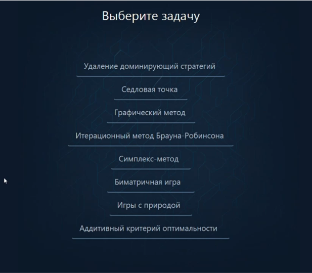

# Проект Диплом 2023

Этот проект является моей дипломной работы, выполненной в 2023 году. 

Целью данного дипломного проекта является разработка приложения на языке программирования Java, специально предназначенного для изучения теории игр. Это приложение предоставляет пользователю доступ к теоретическим материалам, примерам задач, а также встроенным калькулятором для решения задач. Основной задачей приложения является помочь пользователям углубить свои знания в области теории игр и совершенствовать свои навыки в решении задач.

### Технологии
Java 17, MySQL,  Maven, JavaFX 

## Структура проекта

Скриншот первой страницы приложения

Изображение, демонстрирующее ввод данных

Изображение с лекцией

Визуализация статистических данных

Пример задачи

Изображение теста

